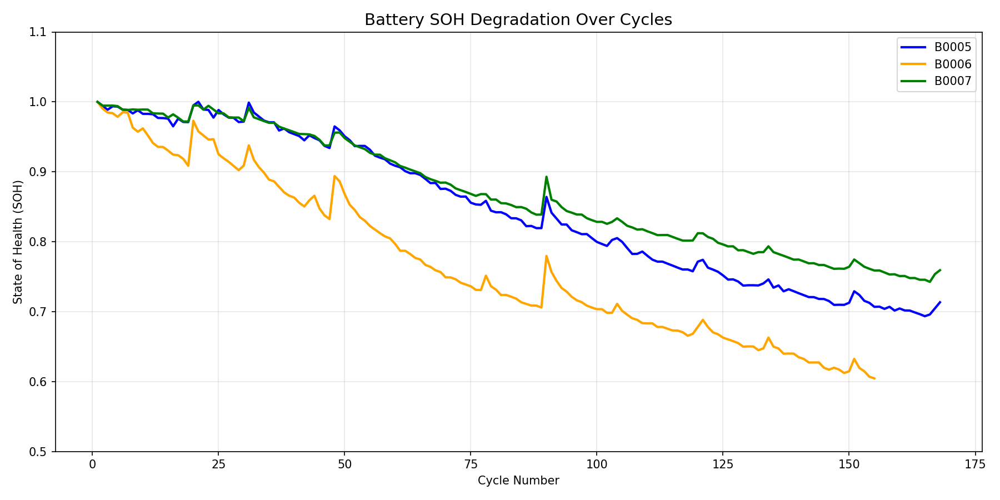
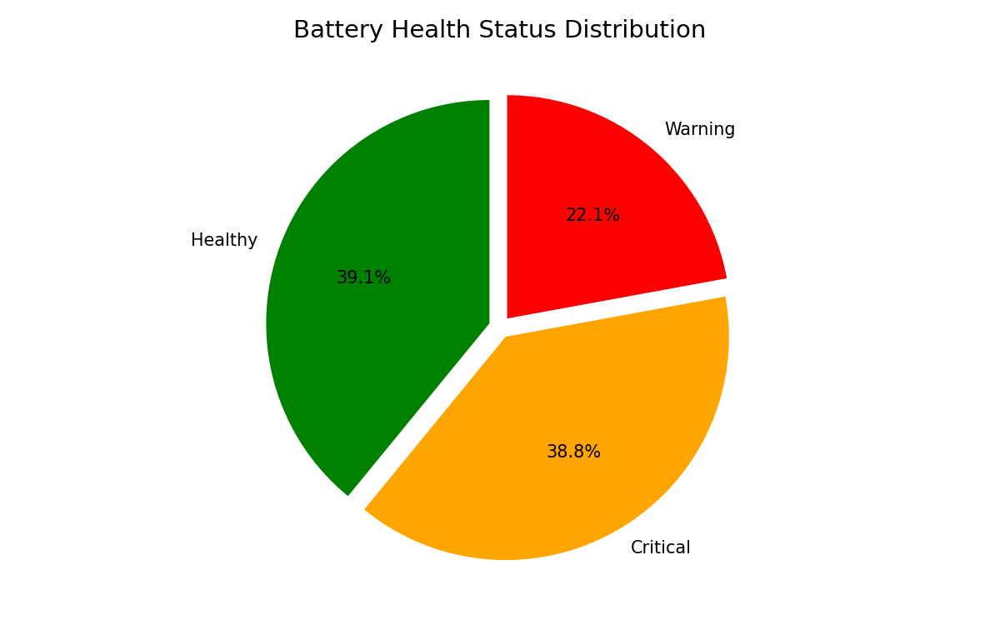
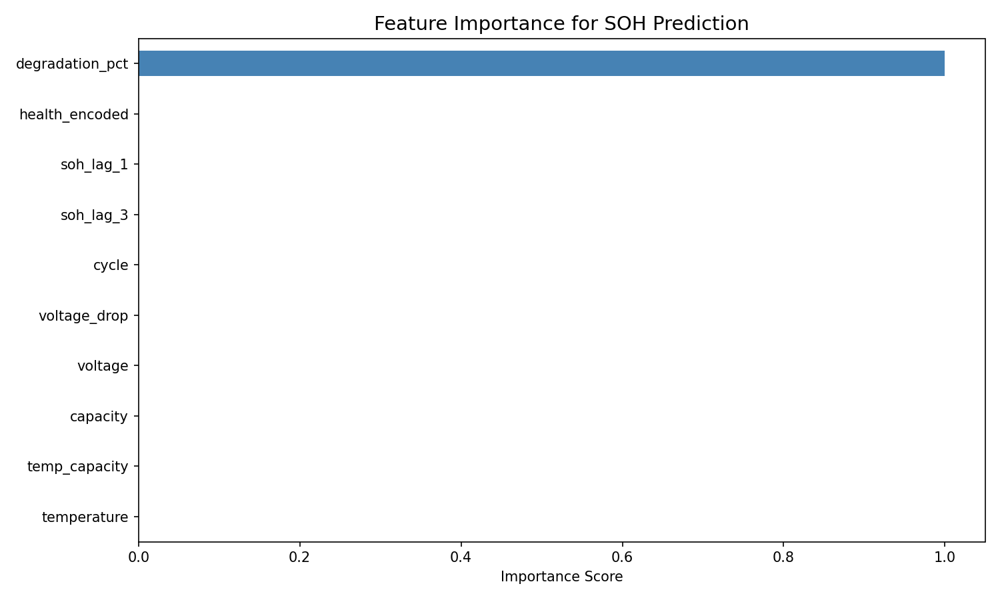
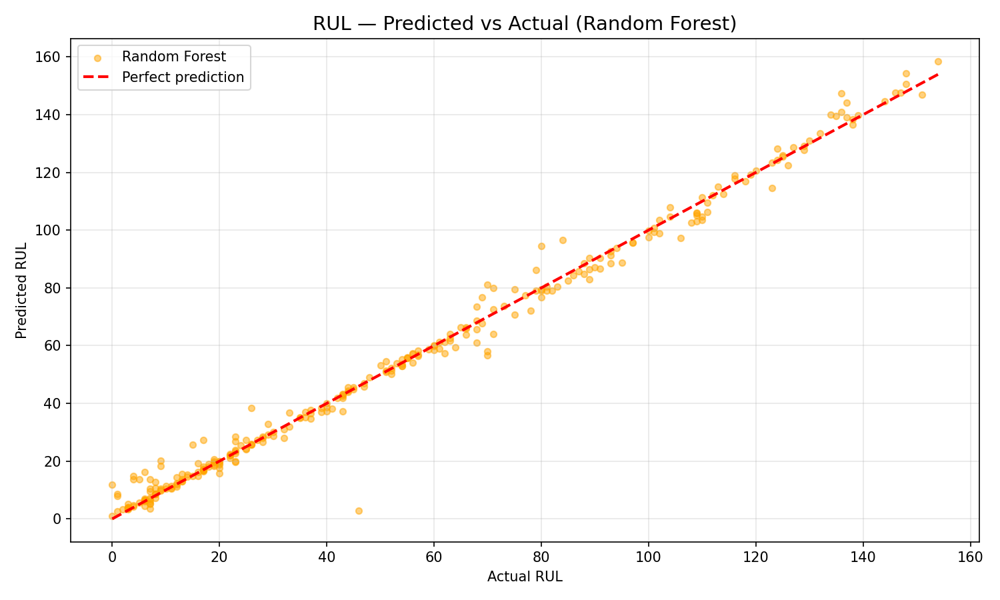

# Battery Health Predictor

## Project Overview
An end-to-end data science project predicting **State of Health (SOH)** 
and **Remaining Useful Life (RUL)** of EV batteries using real NASA 
battery cycle data.

## Tools Used
- **Excel** — Exploratory data analysis and visualization
- **MySQL** — Data storage, querying and enrichment
- **Python/ML** — Feature engineering and predictive modelling
- **Flask** — REST API for real-time predictions

## Dataset
- 1,415 records across 34 batteries
- 7 original features → enriched to 14 features
- Source: NASA Battery Dataset

## Key Results

### SOH Prediction
| Model | MAE | RMSE | R² |
|-------|-----|------|----|
| Linear Regression | 0.0000 | 0.0000 | 1.0000 |
| Random Forest | 0.0003 | 0.0004 | 1.0000 |
| XGBoost | 0.0010 | 0.0013 | 0.9999 |

### RUL Prediction
| Model | MAE | RMSE | R² |
|-------|-----|------|----|
| Linear Regression | 25.31 | 32.46 | 0.41 |
| Random Forest | 2.46 | 4.50 | 0.9886 |
| XGBoost | 2.79 | 5.74 | 0.9815 |

## Battery Health Distribution
- Healthy: 39.1%
- Critical: 38.8%
- Warning: 22.1%

## API Usage
Start the prediction API:
```bash
python app.py
```

Test with curl:
```bash
curl -X POST http://127.0.0.1:5000/predict \
-H "Content-Type: application/json" \
-d '{"cycle": 50, "voltage": 3.5, "temperature": 32.5, "capacity": 1.85}'
```

Response:
```json
{
  "predictions": {
    "predicted_soh": 1.0,
    "predicted_rul": 153,
    "health_status": "Healthy",
    "degradation_pct": 0.0
  },
  "status": "success"
}
```


## Project Structure

battery-health-predictor/
├── 01_preprocessing.ipynb
├── 02_eda.ipynb
├── 03_modelling.ipynb
├── app.py
├── soh_model.pkl
├── rul_model.pkl
└── queries.sql

## Charts




